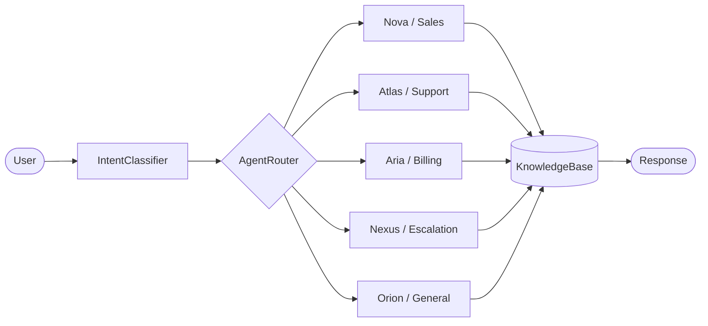

# Synapse — Multi-Agent AI Chatbot


An intelligent customer-service chatbot powered by **five specialized AI agents** that automatically classify user intent and route conversations to the right specialist — all in real time.

**[Live Demo](https://chatbot-multiagente-ia.vercel.app)**

---

## Features

- **5 Specialized AI Agents** — Nova (Sales), Atlas (Tech Support), Aria (Billing), Nexus (Escalation), Orion (General)
- **Intent Classification** — keyword-based NLP engine with confidence scoring and automatic agent routing
- **Sentiment Analysis** — detects frustration and urgency to trigger escalation paths
- **Multi-Intent Detection** — resolves overlapping intents by scoring across all agent domains
- **Smart Agent Routing** — seamless mid-conversation transfers with visual indicators
- **Conversation Export** — download full chat history in TXT or JSON format
- **Agent Performance Stats** — per-agent message counts, satisfaction ratings, and top intent breakdowns
- **ElevenLabs Voice** — text-to-speech widget for spoken agent responses
- **Interactive Tour** — step-by-step onboarding overlay for first-time users
- **Bilingual UI** — full English and Spanish support throughout the interface
- **Knowledge Base** — built-in FAQ corpus used for instant offline answers

---

## Architecture



---

## Tech Stack

| Layer | Technology |
|-------|-----------|
| Frontend | React 18, Vite 5 |
| Backend | Node.js, Express |
| AI | Claude API (Anthropic) |
| Voice | ElevenLabs TTS |
| Automation | n8n (webhook integrations) |
| Testing | Vitest, Testing Library |

---

## Project Structure

```
01-chatbot-multiagente/
├── server/
│   ├── index.js                  # Express API — CORS, rate limiting, routing
│   ├── knowledge-base.js         # Server-side FAQ corpus
│   └── agents/
│       ├── classifier.js         # Server-side intent classification
│       ├── sales.js              # Nova — sales handler
│       ├── support.js            # Atlas — tech support handler
│       ├── billing.js            # Aria — billing handler
│       ├── escalation.js         # Nexus — escalation handler
│       └── general.js            # Orion — general handler
├── src/
│   ├── App.jsx                   # Root component — layout & state
│   ├── main.jsx                  # Vite entry point
│   ├── components/
│   │   ├── agents/
│   │   │   ├── AgentAvatar.jsx   # Agent avatar with gradient badge
│   │   │   ├── AgentInfo.jsx     # Agent detail panel
│   │   │   └── AgentSelector.jsx # Agent switcher UI
│   │   ├── chat/
│   │   │   ├── ChatPanel.jsx     # Message list container
│   │   │   ├── ChatInput.jsx     # Text input with send button
│   │   │   ├── MessageBubble.jsx # Individual message rendering
│   │   │   ├── QuickActions.jsx  # Suggested prompts
│   │   │   ├── StatsPanel.jsx    # Conversation statistics
│   │   │   ├── AgentStats.jsx    # Per-agent performance view
│   │   │   ├── ExportButton.jsx  # TXT/JSON export trigger
│   │   │   ├── TransferIndicator.jsx
│   │   │   └── TypingIndicator.jsx
│   │   ├── common/
│   │   │   └── ErrorBoundary.jsx
│   │   └── layout/
│   │       ├── Header.jsx
│   │       └── TourOverlay.jsx   # Interactive onboarding tour
│   ├── constants/
│   │   ├── agents.js             # Agent definitions (name, color, role)
│   │   ├── knowledgeBase.js      # Client-side FAQ data
│   │   ├── translations.js       # i18n strings (ES/EN)
│   │   └── icons.js              # SVG icon constants
│   ├── hooks/
│   │   ├── useChat.js            # Core chat logic & state
│   │   └── useVoice.js           # ElevenLabs widget hook
│   ├── services/
│   │   └── chatApi.js            # HTTP client for server API
│   └── utils/
│       ├── intentClassifier.js   # Client-side intent classification
│       ├── statsCalculator.js    # Agent performance analytics
│       ├── conversationExport.js # TXT/JSON export logic
│       ├── agentUtils.js         # Agent helper functions
│       └── messageFormatter.js   # Message display formatting
├── package.json
├── vite.config.js
└── .env                          # Environment variables (not committed)
```

---

## Quick Start

### Prerequisites

- Node.js 18+
- npm 9+

### Installation

```bash
git clone https://github.com/christianescamilla15-cell/chatbot-multiagente-ia
cd chatbot-multiagente-ia
npm install
```

### Environment Variables

Create a `.env` file in the project root:

```env
ANTHROPIC_API_KEY=sk-ant-...
PORT=3010
```

| Variable | Required | Description |
|----------|----------|-------------|
| `ANTHROPIC_API_KEY` | Yes | Anthropic API key for Claude |
| `PORT` | No | Server port (default: `3010`) |

### Run

```bash
# Start both client (port 3001) and server concurrently
npm run dev
```

The app will be available at **http://localhost:3001**.

---

## Testing

```bash
# Run all tests
npm test

# Watch mode
npm run test:watch

# Coverage report
npm run test:coverage
```

---

## Agent Architecture

| Agent | ID | Domain | Description |
|-------|----|--------|-------------|
| **Nova** | `nova` | Sales | Handles pricing inquiries, plan comparisons, trials, discounts, ROI questions, and purchase flows. |
| **Atlas** | `atlas` | Tech Support | Resolves bugs, integration issues, API errors, configuration problems, and provides technical documentation. |
| **Aria** | `aria` | Billing | Manages invoices, payments, refunds, subscription changes, cancellations, and payment method updates. |
| **Nexus** | `nexus` | Escalation | Activated by frustration signals — handles complaints, urgent issues, and routes to human agents when needed. |
| **Orion** | `orion` | General | Covers greetings, company info, security questions, general inquiries, and acts as the fallback agent. |

### How Routing Works

1. The user sends a message.
2. The **IntentClassifier** normalizes the text, matches keywords against all five agent domains, and computes a confidence score.
3. If frustration keywords are detected (e.g., "angry", "unacceptable"), the message is immediately routed to **Nexus** with 95% confidence.
4. Otherwise, the agent with the highest keyword match score is selected. If no keywords match above the 0.4 threshold, the message falls through to **Orion**.
5. The active agent generates a response using Claude API, augmented with the **KnowledgeBase** for instant factual answers.

---

## Docker

```dockerfile
FROM node:18-alpine
WORKDIR /app
COPY package*.json ./
RUN npm ci --omit=dev
COPY . .
RUN npm run build
EXPOSE 3001 3010
CMD ["npm", "run", "dev"]
```

```bash
docker build -t synapse-chatbot .
docker run -p 3001:3001 -p 3010:3010 --env-file .env synapse-chatbot
```

---

## License

[MIT](../../LICENSE)
