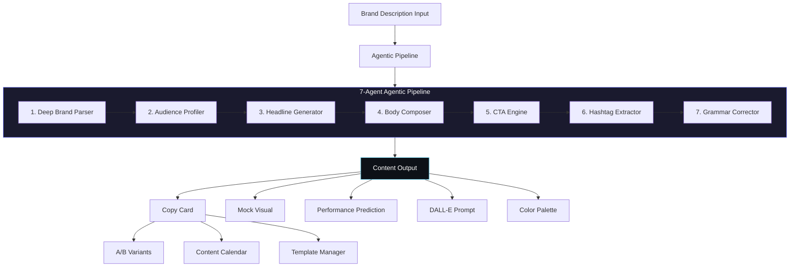

# ContentStudio AI — Multi-Platform Content Generator


> AI-powered content generation studio that creates ready-to-publish social media posts for Instagram, Twitter/X, LinkedIn, and Facebook through a 7-agent agentic pipeline. Generates copy, A/B variants, DALL-E image prompts, color palettes, hashtags, and performance predictions -- all from a single brand description.

**Live demo:** [content-studio-ai-blush.vercel.app](https://content-studio-ai-blush.vercel.app)

---

## Features

- **7-Agent Agentic Pipeline** -- Deep brand parsing, audience profiling, headline generation, body composition, CTA crafting, hashtag extraction, and grammar correction, all chained sequentially
- **4 Platforms** -- Instagram (1080x1080), Twitter/X (1200x675), LinkedIn (1200x627), Facebook (1200x630), each with platform-specific copy rules
- **5 Tones** -- Profesional, Inspirador, Urgente, Divertido, Minimalista
- **5 Formats** -- Producto, Servicio, Evento, Oferta, Branding
- **A/B Variant Generation** -- Side-by-side content variants for split testing
- **DALL-E Image Prompts** -- Auto-generated prompts with industry-specific color palettes and visual direction
- **Content Calendar** -- Schedule and organize posts by date with localStorage persistence
- **Template Manager** -- Save up to 20 reusable brand/platform/tone configurations
- **Performance Predictions** -- Engagement scoring (1-10), optimal posting times, reach multipliers, and actionable tips per platform
- **Industry Color Palettes** -- Automatic palette selection based on detected industry and tone
- **Onboarding Tour** -- Guided walkthrough for first-time users
- **Bilingual** -- Full ES/EN language toggle across the entire UI

---

## Architecture



---

## Tech Stack

| Layer        | Technology                          |
| ------------ | ----------------------------------- |
| Framework    | React 18.2                          |
| Build Tool   | Vite 5                              |
| Testing      | Vitest + Testing Library + jsdom    |
| AI (optional)| Claude API / Hugging Face Inference |
| Image AI     | DALL-E 3 prompt generation          |
| Styling      | CSS-in-JS (inline styles)           |
| Persistence  | localStorage                        |
| Deployment   | Vercel                              |

---

## Project Structure

```
src/
├── App.jsx                          # Main application component
├── main.jsx                         # Entry point
├── components/
│   ├── calendar/
│   │   └── ContentCalendar.jsx      # Content calendar with date scheduling
│   ├── common/
│   │   ├── ContactBar.jsx           # CTA contact bar
│   │   ├── CopyCard.jsx             # Copywriting output card
│   │   ├── ErrorBoundary.jsx        # React error boundary
│   │   ├── MockVisual.jsx           # Visual preview mock-up
│   │   └── Toast.jsx                # Toast notification
│   ├── content/
│   │   └── PerformancePrediction.jsx# Engagement score & tips display
│   ├── onboarding/
│   │   └── OnboardingTour.jsx       # Guided onboarding walkthrough
│   └── templates/
│       └── TemplateManager.jsx      # Save/load brand configurations
├── constants/
│   ├── industryData.js              # Palettes, emojis, posting times, hashtags
│   ├── platforms.js                 # Platform/tone/format definitions
│   ├── tourSteps.js                 # Onboarding tour step text
│   └── translations.js             # ES/EN UI translations
├── hooks/
│   ├── useCalendar.js               # Calendar CRUD (localStorage)
│   ├── useContentHistory.js         # Generation history & stats tracking
│   ├── useTemplates.js              # Template save/load/delete
│   └── __tests__/
│       └── useContentHistory.test.js
├── services/
│   ├── agenticPipeline.js           # 7-agent local content pipeline
│   └── generateApi.js               # Claude / HuggingFace / server API calls
├── utils/
│   ├── brandParser.js               # Brand text NLP parsing
│   ├── contentFormatter.js          # Grammar correction & length enforcement
│   ├── contentGenerator.js          # Headline formulas & DALL-E prompt builder
│   ├── hashtagGenerator.js          # Contextual hashtag generation
│   ├── performancePredictor.js      # Engagement scoring algorithm
│   ├── rng.js                       # Seeded RNG for deterministic output
│   └── __tests__/
│       ├── brandParser.test.js
│       ├── contentFormatter.test.js
│       ├── contentGenerator.test.js
│       ├── hashtagGenerator.test.js
│       └── rng.test.js
└── test/
    └── setup.js                     # Vitest global setup
```

---

## Quick Start

```bash
# Clone and navigate
git clone https://github.com/christianescamilla15-cell/content-studio-ai.git
cd content-studio-ai

# Install dependencies
npm install

# Start dev server (port 3002)
npm run dev
```

Open [http://localhost:3002](http://localhost:3002) in your browser.

---

## Testing

```bash
# Run all tests (103 tests)
npm test

# Watch mode
npm run test:watch

# Coverage report
npm run test:coverage
```

Test suites cover brand parsing, content formatting, content generation, hashtag generation, RNG determinism, and content history hooks.

---

## Agentic Pipeline

The core of ContentStudio is a **7-agent sequential pipeline** that runs entirely client-side with zero API calls required. Each agent processes and enriches the output before passing it to the next.

| # | Agent             | Responsibility                                                                 |
|---|-------------------|--------------------------------------------------------------------------------|
| 1 | **Deep Brand Parser**   | Extracts product name, core benefit, audience, features, metrics, and adjectives from free-text brand description |
| 2 | **Audience Profiler**   | Identifies product type, value propositions, emotional triggers, pain points, desires, and buying stage |
| 3 | **Headline Generator**  | Produces contextual headlines using extracted benefits, metrics, and audience -- adapted per tone and language |
| 4 | **Body Composer**       | Builds persuasive body copy referencing audience pain points, product features, and quantified metrics |
| 5 | **CTA Engine**          | Crafts action-oriented calls-to-action using the product name and relevant metrics |
| 6 | **Hashtag Extractor**   | Generates platform-optimized hashtags from industry, format, and brand context |
| 7 | **Grammar Corrector**   | Applies grammar correction, infinitive cleaning, and max-length enforcement to all text fields |

The pipeline also generates visual assets (DALL-E prompt, color palette, emoji set) and optimal posting times using seeded RNG for deterministic, reproducible output.

When an API key is provided, the app can optionally enhance generation through Claude API or Hugging Face Inference for higher-quality, model-driven copy.

---

## Environment Variables

Create a `.env` file in the project root. All variables are **optional** -- the app works fully offline with the built-in agentic pipeline:

```env
# Claude API (optional, for AI-enhanced generation)
VITE_ANTHROPIC_API_KEY=sk-ant-...

# Hugging Face (optional, alternative AI provider)
VITE_HF_TOKEN=hf_...
```

API keys can also be entered directly in the UI settings panel and are stored in localStorage.

---

## Docker

```dockerfile
FROM node:20-alpine AS build
WORKDIR /app
COPY package*.json ./
RUN npm ci
COPY . .
RUN npm run build

FROM nginx:alpine
COPY --from=build /app/dist /usr/share/nginx/html
EXPOSE 80
CMD ["nginx", "-g", "daemon off;"]
```

```bash
# Build and run
docker build -t content-studio-ai .
docker run -p 3002:80 content-studio-ai
```

---

## License

MIT License. See [LICENSE](../../LICENSE) for details.
