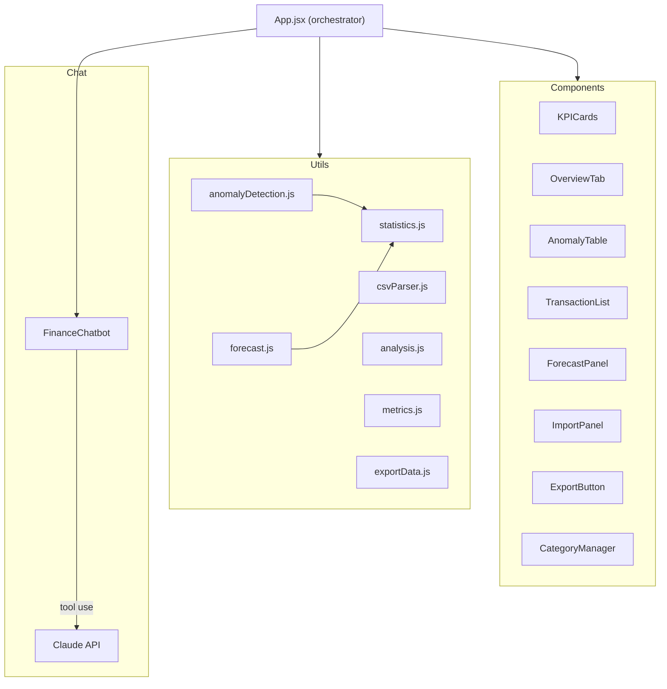

# FinanceAI Dashboard

Intelligent financial dashboard with statistical anomaly detection, linear regression forecasting, and an AI-powered chatbot — built entirely on the client side.


## Demo

**Live:** [https://finance-ai-dashboard-omega.vercel.app](https://finance-ai-dashboard-omega.vercel.app)

Fully functional demo with mock data — no API key required to explore the dashboard, anomaly detection, and forecasting features.

## Features

- :mag: **Statistical anomaly detection** — z-score analysis per category with configurable thresholds
- :chart_with_upwards_trend: **Linear regression forecasting** — month-ahead cash flow projections with R² confidence
- :file_folder: **CSV/TSV import** — auto-detects delimiters, date formats, and currency symbols
- :outbox_tray: **Data export** — download transactions as CSV or JSON
- :crescent_moon: **Dark / Light theme** — persistent toggle with localStorage
- :robot: **AI chatbot** — Claude API with tool-use for real-time financial queries
- :bookmark_tabs: **Category management** — 7 built-in spending categories + custom categories
- :globe_with_meridians: **Bilingual UI** — full Spanish and English support
- :iphone: **Responsive design** — works on desktop and mobile
- :shield: **Error boundaries** — graceful fallback for every panel

## Architecture



## Tech Stack

| Technology | Purpose |
|---|---|
| React 18 | UI framework |
| Vite 5 | Build tool and dev server |
| Recharts 3 | Data visualization (charts, sparklines) |
| Claude API | AI chatbot with tool use |
| Vitest 4 | Unit testing (104 tests) |
| Testing Library | Component and DOM testing |
| Vercel | Production deployment |

## Project Structure

```
src/
├── App.jsx                          # Main orchestrator — state, derived data, tab routing
├── main.jsx                         # Entry point
├── components/
│   ├── charts/
│   │   ├── DarkTooltip.jsx          # Styled chart tooltip
│   │   ├── MiniBarChart.jsx         # Compact bar chart for KPIs
│   │   └── Sparkline.jsx            # Inline trend sparklines
│   ├── chat/
│   │   ├── FinanceChatbot.jsx       # AI chatbot UI shell
│   │   ├── chatbotTools.js          # Claude API tool definitions
│   │   ├── chatbotToolExecutor.js   # Tool execution engine
│   │   ├── chatbotKB.js             # Local knowledge base + intent matching
│   │   └── __tests__/
│   │       └── chatbotToolExecutor.test.js
│   ├── common/
│   │   ├── AnimatedValue.jsx        # Animated number transitions
│   │   ├── ContactBar.jsx           # CTA contact bar
│   │   ├── ErrorBoundary.jsx        # Graceful error fallback
│   │   ├── OnboardingTour.jsx       # First-visit guided tour
│   │   ├── Skeleton.jsx             # Loading skeleton placeholders
│   │   └── ThemeToggle.jsx          # Dark/light theme switch
│   └── dashboard/
│       ├── AnomalyRow.jsx           # Single anomaly row with score
│       ├── AnomalyTable.jsx         # Anomaly list + AI analysis
│       ├── CategoryManager.jsx      # Custom category CRUD
│       ├── ExportButton.jsx         # CSV/JSON export dropdown
│       ├── ForecastPanel.jsx        # Regression forecast + alerts
│       ├── ImportPanel.jsx          # CSV/TSV file importer
│       ├── KPICards.jsx             # Summary metric cards
│       ├── OverviewTab.jsx          # Charts and category breakdown
│       └── TransactionList.jsx      # Filterable transaction table
├── constants/
│   ├── animation.js                 # Shared animation easing constants
│   ├── colors.js                    # Color palette constants
│   ├── mockData.js                  # Demo transaction dataset
│   └── translations.js             # ES/EN string dictionary
├── hooks/
│   └── useTheme.js                  # Theme state + localStorage persistence
├── services/
│   └── api.js                       # HTTP client with retry logic
├── test/
│   └── setup.js                     # Vitest + Testing Library config
└── utils/
    ├── analysis.js                  # AI analysis text generation
    ├── anomalyDetection.js          # Z-score anomaly detection engine
    ├── csvParser.js                 # CSV/TSV parser with auto-detection
    ├── exportData.js                # CSV and JSON export utilities
    ├── forecast.js                  # Linear regression forecasting
    ├── formatting.js                # Currency and number formatting
    ├── metrics.js                   # Aggregation and KPI computation
    ├── statistics.js                # Mean, std dev, linear regression
    └── __tests__/                   # Unit tests for all utilities
        ├── analysis.test.js
        ├── anomalyDetection.test.js
        ├── csvParser.test.js
        ├── exportData.test.js
        ├── forecast.test.js
        ├── formatting.test.js
        ├── metrics.test.js
        └── statistics.test.js
```

## Quick Start

```bash
git clone https://github.com/your-username/portafolio-completo.git
cd portafolio-completo/proyectos/03-finance-ai
npm install
npm run dev
```

The dashboard opens at [http://localhost:3003](http://localhost:3003).

## Testing

```bash
npm test              # Run all 104 tests
npm run test:watch    # Watch mode
npm run test:coverage # With coverage report
```

Tests cover all utility modules (statistics, anomaly detection, CSV parsing, forecasting, formatting, metrics, analysis, data export) and the chatbot tool execution engine.

## Environment Variables

| Variable | Required | Description |
|---|---|---|
| `ANTHROPIC_API_KEY` | No | Enables the AI chatbot powered by Claude. The dashboard works fully without it — anomaly detection and forecasting run client-side. |

Create a `.env` file in the project root:

```env
ANTHROPIC_API_KEY=sk-ant-...
```

## Statistical Methods

### Anomaly Detection

Transactions are flagged as anomalies when they deviate more than **2 standard deviations** from their category mean (z-score method). When a category has fewer than 3 transactions, the system falls back to global statistics. Each transaction receives a normalized anomaly score (0-1) for risk ranking.

### Cash Flow Forecasting

Monthly spending totals are fed into a **least-squares linear regression** model. The output includes:

- Projected spend for the next month
- R² confidence score indicating model fit
- Month-over-month growth rates
- Category-level trend analysis
- Automated alerts for high-growth categories, concentration risk, and anomaly rate thresholds

### Category Analysis

Statistics are computed both globally and per-category. The system tracks 7 default categories (Marketing, Nomina, Software, Infraestructura, Logistica, Ventas, Operaciones) and supports user-defined custom categories.

## Docker

```bash
docker build -t finance-ai .
docker run -p 8080:80 finance-ai
```

Access the dashboard at [http://localhost:8080](http://localhost:8080).

## License

MIT
