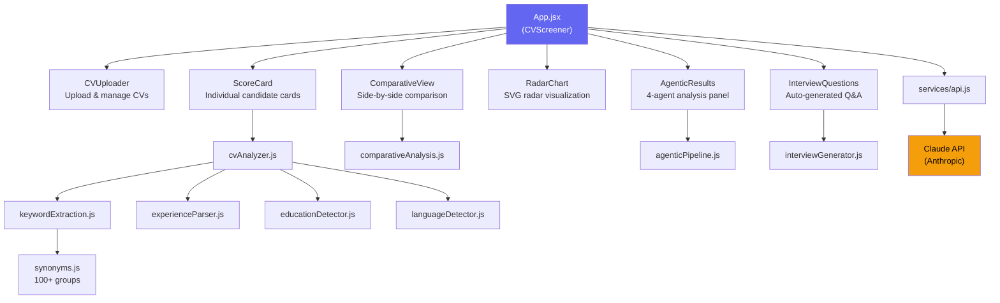

# HRScout — AI-Powered CV Screening


> Intelligent CV screening platform that scores, ranks, and compares candidates against job descriptions using a 4-agent pipeline, synonym-aware keyword matching, and auto-generated interview questions.

**[Live Demo](https://hr-scout-llm.vercel.app)**

---

## Features

- :brain: **AI Scoring 0-100** — Weighted formula combining keyword match, experience, education, and language proficiency
- :mag: **Synonym Matching** — 100+ synonym groups ensure "React" matches "ReactJS", "Node" matches "node.js", etc.
- :file_folder: **Batch Upload** — Analyze multiple CVs simultaneously against a single job description
- :bar_chart: **Radar Chart Comparison** — Pure SVG radar visualization comparing candidates across 5 dimensions
- :speech_balloon: **Interview Question Generator** — Auto-generates technical, experience, culture-fit, and problem-solving questions per candidate
- :robot: **Agentic 4-Agent Pipeline** — Skills Extractor, Experience Evaluator, Job Fit Analyzer, and Recommendation Engine work in sequence
- :world_map: **Heatmap & Comparative View** — Side-by-side candidate analysis with visual strength/gap indicators
- :page_facing_up: **Export Reports** — Download full analysis reports as text files
- :globe_with_meridians: **Bilingual UI** — Full Spanish and English interface with one-click toggle

---

## Architecture



---

## Tech Stack

| Layer        | Technology                      |
| ------------ | ------------------------------- |
| Framework    | React 18                        |
| Build Tool   | Vite 5                          |
| AI API       | Claude API (Anthropic)          |
| Testing      | Vitest + Testing Library + jsdom |
| Charts       | Pure SVG (zero dependencies)    |
| Styling      | Inline CSS-in-JS                |
| Deployment   | Vercel                          |

---

## Project Structure

```
04-hr-scout/
├── src/
│   ├── App.jsx                          # Main CVScreener component
│   ├── main.jsx                         # Entry point
│   ├── components/
│   │   ├── analysis/
│   │   │   ├── AgenticResults.jsx       # 4-agent pipeline results panel
│   │   │   ├── InterviewQuestions.jsx    # Generated interview questions display
│   │   │   └── ScoreCard.jsx            # Candidate score card with details
│   │   ├── comparison/
│   │   │   ├── ComparativeView.jsx      # Side-by-side candidate comparison
│   │   │   └── RadarChart.jsx           # Pure SVG radar chart
│   │   ├── common/
│   │   │   ├── ErrorBoundary.jsx        # React error boundary
│   │   │   └── Skeleton.jsx             # Loading skeleton placeholders
│   │   ├── layout/
│   │   │   └── Header.jsx               # Contact bar + guided tour overlay
│   │   └── upload/
│   │       └── CVUploader.jsx           # Add candidate modal
│   ├── constants/
│   │   ├── colors.js                    # Theme color definitions
│   │   ├── presetJobs.js               # Sample job descriptions
│   │   ├── sampleCvs.js               # Demo CV data
│   │   ├── synonyms.js                # 100+ synonym groups for skill matching
│   │   └── translations.js            # ES/EN translation strings
│   ├── services/
│   │   └── api.js                      # Claude API integration + tool use
│   ├── utils/
│   │   ├── agenticPipeline.js          # 4-agent orchestration pipeline
│   │   ├── comparativeAnalysis.js      # Multi-candidate comparison logic
│   │   ├── cvAnalyzer.js              # Core scoring engine (0-100)
│   │   ├── educationDetector.js       # Degree & certification detection
│   │   ├── experienceParser.js        # Years of experience extraction
│   │   ├── interviewGenerator.js      # Context-aware question generation
│   │   ├── keywordExtraction.js       # Job description keyword parser
│   │   ├── languageDetector.js        # Language proficiency detection
│   │   ├── reportGenerator.js         # Exportable text report builder
│   │   └── textNormalization.js       # Accent/case normalization
│   └── test/
│       └── setup.js                    # Vitest test configuration
├── package.json
├── vite.config.js
└── index.html
```

---

## Quick Start

### Prerequisites

- Node.js 18+
- npm 9+
- Claude API key from [Anthropic Console](https://console.anthropic.com/)

### Installation

```bash
cd proyectos/04-hr-scout
npm install
```

### Run Development Server

```bash
npm run dev
# Accessible at http://localhost:3004
```

### Production Build

```bash
npm run build
npm run preview
```

---

## Testing

```bash
# Run all 103 tests
npm test

# Watch mode
npm run test:watch

# Coverage report
npm run test:coverage
```

Test suites cover all utility modules:

| Suite                         | Covers                                      |
| ----------------------------- | ------------------------------------------- |
| `cvAnalyzer.test.js`          | Scoring engine, edge cases, score boundaries |
| `keywordExtraction.test.js`   | Keyword parsing, synonym resolution          |
| `experienceParser.test.js`    | Year extraction from varied CV formats       |
| `educationDetector.test.js`   | Degree levels, certifications                |
| `languageDetector.test.js`    | Language proficiency detection               |
| `comparativeAnalysis.test.js` | Multi-candidate ranking logic                |
| `reportGenerator.test.js`     | Export report structure                      |
| `textNormalization.test.js`   | Accent stripping, case normalization         |

---

## Scoring Methodology

The scoring engine in `cvAnalyzer.js` produces a score from 5 to 98 using a weighted formula:

### 1. Keyword Matching (70%)

Job description keywords are extracted and matched against the CV using **synonym groups** (100+ groups defined in `synonyms.js`). Required keywords are weighted **2x** compared to desirable ones.

```
keywordScore = matchedWeight / totalWeight
keywordComponent = keywordScore * 70
```

### 2. Experience Parsing (up to 12 pts)

Years of experience are extracted from patterns like "5 years experience", "2020-present", etc. Full points if the candidate meets or exceeds the requirement; proportional points otherwise.

### 3. Education Detection (up to 12 pts)

- **Degree level** (up to 8 pts): PhD/Master = 8, Bachelor = 6, Technical = 3
- **Certifications** (up to 4 pts): 2 points per relevant certification

### 4. Language Proficiency (up to 6 pts)

English proficiency is scored when the job requires it: Advanced = 6, Intermediate = 4, Basic = 2.

### Score Ranges

| Score   | Verdict           | Action                              |
| ------- | ----------------- | ----------------------------------- |
| 80-98   | Strong Candidate  | Schedule technical interview         |
| 60-79   | Partial Match     | Add to waitlist, evaluate gaps       |
| 5-59    | Not Aligned       | Discard for this role                |

---

## Agentic Pipeline

The 4-agent pipeline (`agenticPipeline.js`) runs sequentially:

1. **Skills Extractor** — Categorizes skills into programming, AI/ML, cloud, databases, and soft skills
2. **Experience Evaluator** — Parses years of experience and seniority indicators
3. **Job Fit Analyzer** — Calculates alignment percentage between CV skills and job requirements
4. **Recommendation Engine** — Generates hire/maybe/pass verdict with actionable next steps

---

## Environment Variables

| Variable              | Description                        | Required |
| --------------------- | ---------------------------------- | -------- |
| `VITE_ANTHROPIC_KEY`  | Claude API key for AI-enhanced analysis | No (app works offline with local scoring) |

The API key can also be entered directly in the UI via the settings panel. It is stored in `localStorage` and never sent to any server other than the Anthropic API.

---

## Docker

```dockerfile
FROM node:18-alpine AS build
WORKDIR /app
COPY package*.json ./
RUN npm ci
COPY . .
RUN npm run build

FROM nginx:alpine
COPY --from=build /app/dist /usr/share/nginx/html
EXPOSE 80
CMD ["nginx", "-g", "daemon off;"]
```

```bash
docker build -t hr-scout .
docker run -p 3004:80 hr-scout
```

---

## License

MIT
