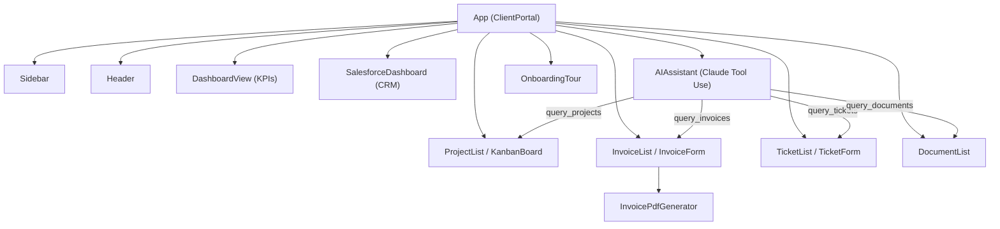

# ClientHub — AI-Powered Client Portal


> A zero-backend client portal with project tracking, invoicing, support tickets, document management, and an AI assistant powered by Claude Tool Use — all running in the browser.

**Live demo:** [client-hub-nocode.vercel.app](https://client-hub-nocode.vercel.app)

---

## Features

- **5 Core Modules** — Projects, Invoices, Tickets, Documents, Salesforce CRM
- **Kanban Board** — Drag-and-drop project management with status columns
- **Invoice PDF Generation** — Print-ready invoices with tax calculations (IVA 16%)
- **AI Assistant** — Claude Tool Use integration that queries live portal data
- **KPI Dashboard** — Real-time metrics for projects, revenue, and tickets
- **Notification Center** — Auto-generated alerts from project and invoice state
- **10-Step Onboarding Tour** — Guided walkthrough for first-time users
- **Bilingual UI** — Full Spanish / English toggle with zero page reload
- **Local Persistence** — All data survives refresh via localStorage
- **Error Boundary** — Graceful failure handling with toast notifications

---

## Architecture



---

## Tech Stack

| Layer        | Technology                          |
| ------------ | ----------------------------------- |
| Framework    | React 18.2                          |
| Build Tool   | Vite 5                              |
| AI           | Claude API (Anthropic) — Tool Use   |
| CRM          | Salesforce REST API v59.0           |
| Testing      | Vitest + React Testing Library      |
| Coverage     | @vitest/coverage-v8                 |
| Styling      | CSS-in-JS (inline styles)           |
| Persistence  | localStorage                        |
| Deployment   | Vercel                              |

---

## Project Structure

```
05-client-hub/
├── src/
│   ├── App.jsx                         # Root component & state management
│   ├── main.jsx                        # Vite entry point
│   ├── components/
│   │   ├── assistant/
│   │   │   └── AIAssistant.jsx         # Claude Tool Use chat interface
│   │   ├── common/
│   │   │   ├── ErrorBoundary.jsx       # Catch & display render errors
│   │   │   ├── Modal.jsx               # Reusable modal dialog
│   │   │   ├── ProgressBar.jsx         # Animated progress indicator
│   │   │   ├── Sidebar.jsx             # Navigation sidebar
│   │   │   ├── StatusBadge.jsx         # Color-coded status labels
│   │   │   └── ToastContainer.jsx      # Notification toasts
│   │   ├── documents/
│   │   │   └── DocumentList.jsx        # File browser with type icons
│   │   ├── invoices/
│   │   │   ├── InvoiceForm.jsx         # Create / edit invoices
│   │   │   ├── InvoiceList.jsx         # Invoice table with filters
│   │   │   └── InvoicePdfButton.jsx    # One-click PDF export
│   │   ├── layout/
│   │   │   ├── ContactBar.jsx          # CTA contact strip
│   │   │   ├── DashboardView.jsx       # KPI cards & summary
│   │   │   └── Header.jsx             # Top bar with search & lang toggle
│   │   ├── projects/
│   │   │   ├── KanbanBoard.jsx         # Drag-and-drop Kanban columns
│   │   │   └── ProjectList.jsx         # Table view for projects
│   │   ├── tickets/
│   │   │   ├── TicketForm.jsx          # Create / edit tickets
│   │   │   └── TicketList.jsx          # Ticket table with status flow
│   │   └── tour/
│   │       └── OnboardingTour.jsx      # 10-step guided walkthrough
│   ├── constants/
│   │   ├── colors.js                   # Status colors & ticket flow
│   │   ├── mockData.js                 # Seed data for all modules
│   │   ├── navigation.js               # Sidebar nav items & section titles
│   │   └── translations.js             # ES/EN translation dictionaries
│   │   ├── salesforce/
│   │   │   └── SalesforceDashboard.jsx # CRM pipeline, contacts, accounts, cases
│   ├── services/
│   │   ├── api.js                      # Claude API client with Tool Use
│   │   └── salesforce.js               # Salesforce REST API wrapper + demo mode
│   ├── utils/
│   │   ├── documentUtils.js            # File type detection
│   │   ├── invoiceCalculator.js        # Currency formatting & math
│   │   ├── invoicePdfGenerator.js      # HTML-to-print invoice renderer
│   │   ├── projectUtils.js             # Notification generation
│   │   ├── searchFilter.js             # localStorage helpers & search
│   │   └── ticketUtils.js              # Ticket status transitions
│   └── test/
│       └── setup.js                    # Vitest global setup
├── package.json
├── vite.config.js
└── index.html
```

---

## Quick Start

```bash
# Clone the repository
git clone https://github.com/your-user/portafolio-completo.git
cd portafolio-completo/proyectos/05-client-hub

# Install dependencies
npm install

# Start development server (port 3005)
npm run dev
```

Open [http://localhost:3005](http://localhost:3005) in your browser.

### Production Build

```bash
npm run build
npm run preview
```

---

## Testing

```bash
# Run all tests (113 specs)
npm test

# Watch mode
npm run test:watch

# Coverage report
npm run test:coverage
```

Test suites cover:

- `translations.test.js` — Bilingual key parity
- `api.test.js` — Claude Tool Use request/response handling
- `documentUtils.test.js` — File type detection
- `invoiceCalculator.test.js` — Currency formatting & tax math
- `projectUtils.test.js` — Notification generation logic
- `searchFilter.test.js` — localStorage and search helpers
- `ticketUtils.test.js` — Status transition validation
- `salesforce.test.js` — Salesforce service, mock data, factory pattern

---

## Modules

### Projects

Track projects with status (Planificacion, En progreso, Revision, Completado), budget vs. spent, progress percentage, and due dates. Switch between a sortable table view and a Kanban board with drag-and-drop between columns.

### Invoices

Create, edit, and filter invoices by status (Pagada, Pendiente, Vencida). One-click PDF export generates a professional print-ready invoice with line items, IVA 16% tax calculation, and payment terms.

### Tickets

Submit and manage support tickets with priority levels and a defined status flow. The ticket system tracks creation dates, assignees, and resolution status.

### Documents

Browse uploaded files organized by type (PDF, image, spreadsheet, etc.) with automatic file-type icon detection and metadata display.

### Salesforce CRM

Enterprise CRM integration demonstrating Salesforce REST API skills:

- **Pipeline View** — Opportunities displayed in a Kanban-style board by stage (Prospect, Proposal, Negotiation, Closed Won) with deal amounts and close dates
- **Contacts** — Searchable contact list with name, email, phone, and company association
- **Accounts** — Company cards showing industry, billing city, phone, and website
- **Cases** — Ticket-style table synced from Salesforce with priority and status badges
- **Service Layer** — Full Salesforce REST API wrapper (`SalesforceService`) with OAuth 2.0 auth, SOQL queries, and CRUD operations
- **Factory Pattern** — `getSalesforceService()` returns the real API client when credentials are provided, or `DemoSalesforceService` with realistic mock data when running without configuration
- **Zero Config** — Works out of the box in demo mode; no Salesforce credentials needed

### AI Assistant

A chat interface backed by Claude's Tool Use API. The assistant can query live portal data — projects, invoices, tickets, and documents — through structured tool calls, then summarize findings in natural language. Supports bilingual responses.

---

## Environment Variables

| Variable             | Required | Description                                      |
| -------------------- | -------- | ------------------------------------------------ |
| `ANTHROPIC_API_KEY`  | No       | Claude API key for the AI Assistant. The portal works fully without it; the assistant simply remains disabled. |

You can enter the API key directly in the UI settings panel (stored in localStorage) or set it as an environment variable.

---

## Docker

```dockerfile
FROM node:20-alpine AS build
WORKDIR /app
COPY package*.json ./
RUN npm ci
COPY . .
RUN npm run build

FROM nginx:alpine
COPY --from=build /app/dist /usr/share/nginx/html
EXPOSE 80
CMD ["nginx", "-g", "daemon off;"]
```

```bash
docker build -t client-hub .
docker run -p 3005:80 client-hub
```

---

## License

[MIT](../../LICENSE)
