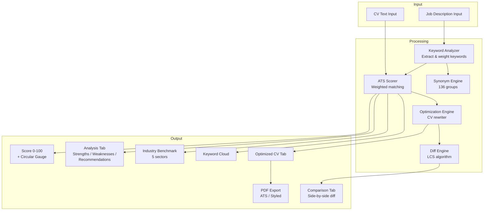

# CV Optimizer AI — ATS Score Analyzer & Resume Optimizer


> Paste your resume and a job description — get an instant ATS compatibility score (0-100), keyword gap analysis, an optimized CV, and a side-by-side diff of every change. Fully offline, bilingual (EN/ES), zero backend required.

---

## Features

| Category | Highlights |
|---|---|
| **ATS Scoring** | Weighted 0-100 score based on keyword match, experience, and education |
| **136 Synonym Groups** | `javascript` matches `js`, `ecmascript`, `es6`; `react` matches `reactjs`, `react.js`, etc. |
| **Keyword Analysis** | Extracts skills from job descriptions with contextual weight detection (required vs. nice-to-have) |
| **Side-by-Side Diff** | LCS-based line-level diff engine highlights additions, removals, and modifications |
| **Industry Benchmarks** | Compare your score against Tech, Marketing, Finance, Healthcare, and Education averages |
| **Keyword Cloud** | Visual representation of matched and missing keywords |
| **PDF Export** | Generate ATS-friendly or styled PDF from the optimized CV |
| **Optimization Engine** | Auto-generates an improved CV injecting missing keywords while preserving your content |
| **Bilingual UI** | Full English and Spanish interface with one-click toggle |

---

## Architecture



---

## Tech Stack

| Layer | Technology |
|---|---|
| Framework | React 18.2 |
| Build Tool | Vite 5 |
| Testing | Vitest + Testing Library + jsdom |
| Coverage | @vitest/coverage-v8 |
| PDF Generation | Native HTML-to-print pipeline |
| Diff Algorithm | Custom LCS (Longest Common Subsequence) |
| NLP | Regex-based keyword extraction + synonym mapping |
| Deployment | Docker (nginx-alpine) |

---

## Project Structure

```
06-cv-optimizer/
├── Dockerfile
├── package.json
├── vite.config.js
└── src/
    ├── main.jsx                          # Entry point
    ├── App.jsx                           # Main orchestrator
    ├── components/
    │   ├── analysis/
    │   │   ├── AnalysisTab.jsx           # Score + strengths/weaknesses
    │   │   ├── IndustryBenchmark.jsx     # Sector comparison bars
    │   │   └── KeywordCloud.jsx          # Visual keyword cloud
    │   ├── common/
    │   │   ├── Card.jsx                  # Reusable card wrapper
    │   │   ├── CircularGauge.jsx         # Animated 0-100 gauge
    │   │   ├── ContactBar.jsx            # CTA contact bar
    │   │   ├── ErrorBoundary.jsx         # React error boundary
    │   │   ├── LoadingStep.jsx           # Multi-step loading indicator
    │   │   └── TabButton.jsx             # Tab navigation button
    │   ├── input/
    │   │   ├── CVInput.jsx               # CV textarea + validation
    │   │   └── JobInput.jsx              # Job description textarea
    │   └── output/
    │       ├── ComparisonTab.jsx         # Side-by-side diff wrapper
    │       ├── DiffView.jsx              # Line-level diff renderer
    │       └── OptimizedTab.jsx          # Optimized CV + PDF export
    ├── constants/
    │   ├── benchmarks.js                 # Industry data + auto-detection
    │   ├── colors.js                     # Theme color palette
    │   ├── sampleData.js                 # Demo CV & job (EN/ES)
    │   └── translations.js               # UI strings (EN/ES)
    ├── services/
    │   └── api.js                        # Fetch with retry + timeout
    ├── test/
    │   └── setup.js                      # Vitest setup
    └── utils/
        ├── atsScorer.js                  # Main analysis engine
        ├── cvParser.js                   # CV section parser
        ├── diffEngine.js                 # LCS-based line diff
        ├── keywordAnalyzer.js            # Keyword extraction + weighting
        ├── optimizationEngine.js         # CV rewriter
        ├── pdfBuilder.js                 # HTML-to-PDF builder
        ├── skillExtractor.js             # Raw text skill/experience extraction
        ├── synonyms.js                   # 136 synonym groups
        └── __tests__/
            ├── atsScorer.test.js
            ├── cvParser.test.js
            ├── keywordAnalyzer.test.js
            ├── optimizationEngine.test.js
            ├── pdfBuilder.test.js
            ├── skillExtractor.test.js
            └── synonyms.test.js
```

---

## Quick Start

```bash
# Clone and navigate
cd proyectos/06-cv-optimizer

# Install dependencies
npm install

# Start dev server (port 3006)
npm run dev
```

Open [http://localhost:3006](http://localhost:3006) in your browser.

---

## Testing

```bash
# Run all tests (120 specs)
npm test

# Watch mode
npm run test:watch

# Coverage report
npm run test:coverage
```

Test suites cover: ATS scorer, CV parser, keyword analyzer, optimization engine, PDF builder, skill extractor, and synonym mapping.

---

## ATS Scoring Methodology

The scoring engine evaluates three dimensions with weighted matching:

### 1. Keyword Match (variable weight per keyword)

Each keyword extracted from the job description is assigned a weight based on surrounding context:

| Context | Weight |
|---|---|
| Required / mandatory / indispensable | **2.0** |
| Default (no qualifier) | **1.5** |
| Desirable / nice-to-have / preferred | **1.0** |

Keywords are matched using **136 synonym groups** (e.g., `python` matches `py`, `python3`). A regex word-boundary check ensures precise matching.

### 2. Experience (weight: 2.0)

Extracts years-of-experience from both the job posting and the CV. Partial credit is awarded proportionally when the candidate falls short.

### 3. Education (weight: 1.5)

Detects education levels on a 4-tier scale:

| Level | Keywords |
|---|---|
| 4 | PhD, Doctorado |
| 3 | Master, MBA, Maestria, Postgrado |
| 2 | Bachelor, Licenciatura, Ingenieria |
| 1 | Bootcamp, Certification, Tecnico |

### Final Score

```
score = (weighted_matches / total_weight) * 100
```

Clamped to **0-100** and rounded to the nearest integer.

### Industry Benchmarks

| Industry | Average | Top 10% |
|---|---|---|
| Tech / Software | 62 | 85 |
| Marketing | 55 | 78 |
| Finance | 58 | 82 |
| Healthcare | 50 | 75 |
| Education | 48 | 72 |

Industry is auto-detected from the job description using keyword frequency analysis.

---

## Environment Variables

This project runs entirely in the browser with **no API keys required** for core functionality. The API service (`src/services/api.js`) provides a generic fetch-with-retry utility for optional backend integrations.

```env
# Optional — only if connecting to an external optimization API
VITE_API_URL=https://your-api-endpoint.com
```

---

## Docker

```bash
# Build
docker build -t cv-optimizer .

# Run
docker run -p 8080:80 cv-optimizer
```

Open [http://localhost:8080](http://localhost:8080). The multi-stage build produces a minimal nginx-alpine image serving the Vite production bundle.

---

## License

MIT
